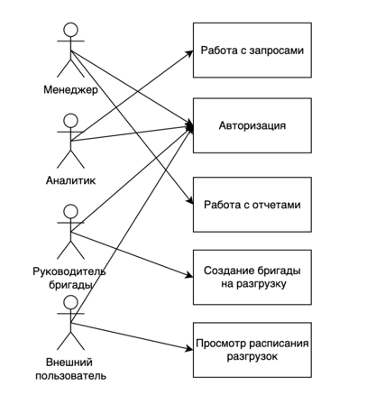
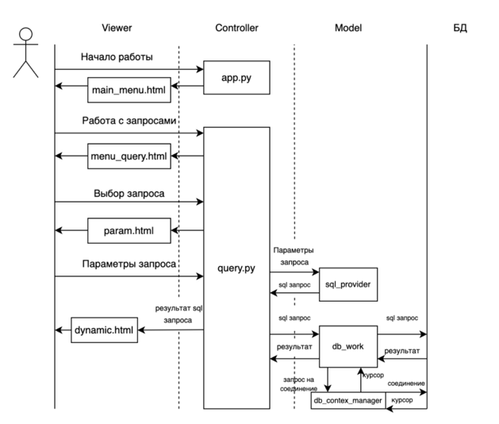
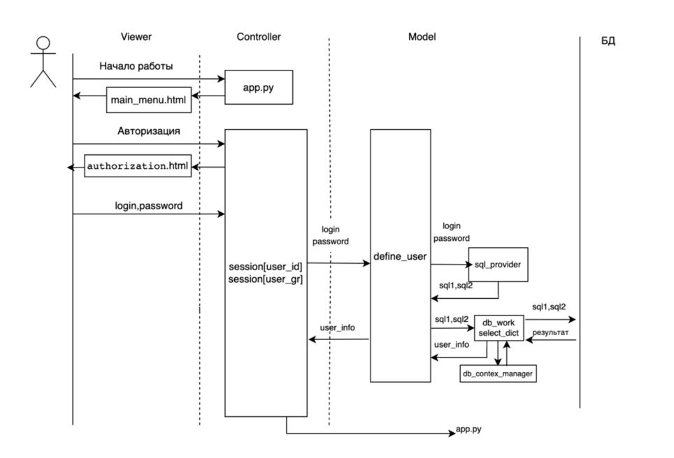
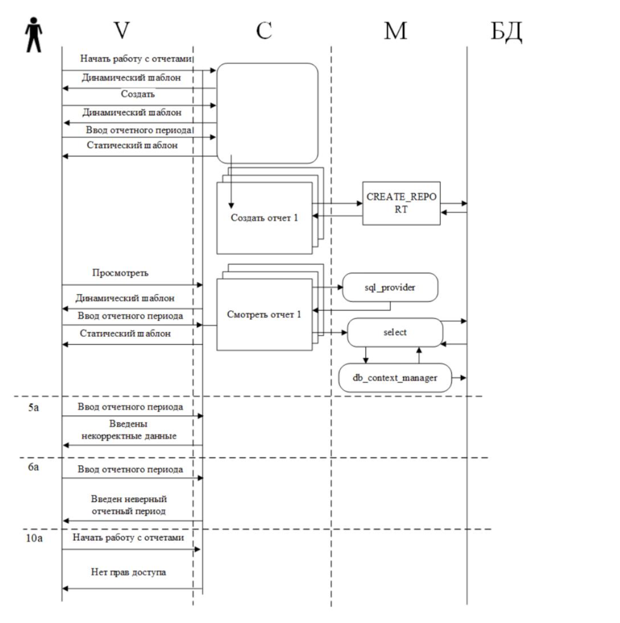
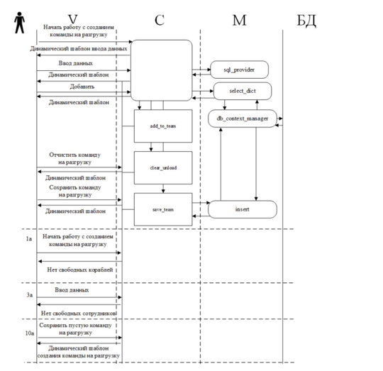

## Курсовая работа по дисицплине "Разработка информационных систем".

---

Дамп Базы данных находтся в Db/Port.sql \
Логин и пароль для полного доступа ИС \
admin \
admin \

Полный отчет находися в файле Peport.pdf \

---

Курсовая работа написана на языке Python при помощи FrameWork Flask. Также в этой работе используется MySql для работы с Базой Данных.

В этой работе представлено три варианта использовани и атворизация.
+ blueprint_query – Вариант использования для работы с внутренними запросами системы.
+ blueprint_auth – Вариант для авторизации пользователей системы.
+ blueprint_report - Вариант для создания и просмотра отчетов БД.
+ blueprint_report – Вариант использованиия основого бизнесс процесса. (Создание бригады на разгрузку корабля)

---
### Техническое требование

Для обеспечения работы порта набираются сотрудники различных профессий: капитаны буксиров, лоцманы, крановщики, электрики,  стропальщики и т.д.
Каждому сотруднику присвоен уникальный номер, известны его фамилия, профессия, дата рождения, адрес, дата приема на  работу. 
Предусмотрена для сохранения также дата увольнения, которая для работающих сотрудников не заполняется.
Для каждого сотрудника ведется табель работы, в котором отмечается дата выхода на работу и количество фактически отработанных часов.
В порту находится несколько причалов, предназначенных для приема различных типов кораблей. Для каждого причала известен тип причала (нефтеналивной, грузовой, зерновой и пр.) его длина и глубина у стенки.
В порт приходят корабли, различных типов, о которых известно их название, тип корабля, тоннаж, порт приписки.
Каждый заход корабля в порт регистрируется. Фиксируются даты прихода в порт и ухода из него, причал, сотрудник, который проводил его в порт.
Если зарегистрированный корабль требует разгрузки, то создается бригада из сотрудников порта, состав которой заносится в БД.
Для каждого члена  бригады проставляется количество часов, отработанных на разгрузке. В дальнейшем эти данные переносятся в табель работы сотрудников.

### Определение конечных пользователей
Целесообразно выделить следующих пользователей информационной системы:

• Менеджер – работает с отчетностью

• Руководитель бригады – работает с основным бизнес-процессом
(создание команды на разгрузку)

• Аналитик – работает с запросами и отчетностью

• Внешние пользователи – имеют доступ к просмотру своего расписания
разгрузок, составленного диспетчером в процессе работы с основным бизнес-
процессом

---

### UML-диаграмма вариантов использования

### Сценарий для работы с запросами

Системная диаграмма последовательностей (MVC)
 

### Сценарий для авторизации пользователей

Системная диаграмма последовательностей (MVC)

### Сценарий для создания и просмотра отчетов 

Системная диаграмма последовательностей (MVC)

### Сценарий для создании команды на разгрузку 

Системная диаграмма последовательностей (MVC)

